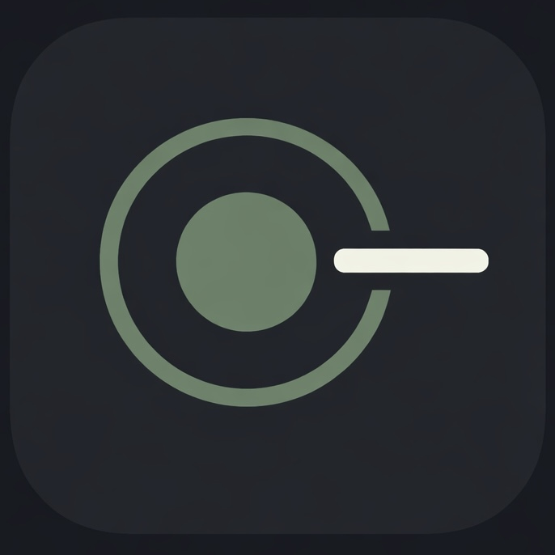

# Apico

<p align="center">
  
</p>

<p align="center">
  <strong>Your pocket API companion</strong>
</p>

<p align="center">
  
  
  
  
  
  
</p>

-----

## What is Apico?

API testing tools like Postman are powerful — but they are built for desktops. Apico is a mobile-first REST API testing tool designed for CSE students, developers, and hackathon participants who need to test and understand APIs on the go.

What sets Apico apart is its AI layer. Instead of just showing you a raw JSON response, Apico explains what it means, why it happened, and how to fix it — powered by Google Gemini. It is the difference between a tool that tests and a tool that teaches.

-----

## Features

- **Request Builder** — Construct GET, POST, PUT, PATCH, and DELETE requests with full control over headers, query params, request body (JSON and form-data), and authentication (Bearer Token, Basic Auth, API Key)
- **AI-Powered Response Analysis** — Gemini explains every response in plain English: what it means, why it happened, how to fix errors, and suggested test cases
- **Pretty JSON Viewer** — Syntax-highlighted response viewer with search/filter and copy support
- **Collections** — Organize saved requests into named folders, replay them instantly
- **Request History** — Chronological log of the last 100 requests with swipe-to-delete and swipe-to-save
- **Environment Variables** — Manage multiple environments (dev, staging, production) with variable substitution using `{{KEY}}` syntax
- **WebSocket Tester** — Real-time full-duplex connection testing with a terminal-style message log
- **Camera Scan** — Point your camera at a URL or API doc to auto-fill the request builder
- **Offline First** — Collections, history, and environments persist locally via AsyncStorage and work without internet
- **Animated Splash Screen** — Clean branded entry experience with Reanimated animations

-----

## Tech Stack

### Frontend

|Package                                  |Version|Purpose                        |
|-----------------------------------------|-------|-------------------------------|
|expo                                     |54.0.33|App framework and build tooling|
|react-native                             |0.81.5 |Core mobile framework          |
|expo-router                              |6.0.22 |File-based navigation          |
|axios                                    |1.13.6 |HTTP request engine            |
|react-native-reanimated                  |4.1.1  |Animations                     |
|phosphor-react-native                    |3.0.3  |Icon library                   |
|@react-native-async-storage/async-storage|2.2.0  |Local persistence              |
|expo-google-fonts                        |latest |IBM Plex Mono, DM Sans, Lora   |

### Backend

|Package            |Purpose              |
|-------------------|---------------------|
|FastAPI            |REST API framework   |
|google-generativeai|Gemini AI integration|
|motor              |Async MongoDB driver |
|uvicorn            |ASGI server          |

-----

## Screenshots

> Screenshots coming soon. Run the app locally to preview all screens.

|Home         |Request Builder|Response + AI|
|-------------|---------------|-------------|
|*placeholder*|*placeholder*  |*placeholder*|

|Collections  |History      |WebSocket    |
|-------------|-------------|-------------|
|*placeholder*|*placeholder*|*placeholder*|

-----

## Getting Started

### Prerequisites

- Node.js 18+
- Python 3.10+
- Expo CLI (`npm install -g expo-cli`)
- A Google Gemini API key — get one free at [aistudio.google.com](https://aistudio.google.com)
- MongoDB instance (local or Atlas)

### Installation

```bash
# Clone the repository
git clone https://github.com/BYTEGUARDIAN14/apico.git
cd apico
```

#### Frontend

```bash
cd frontend
npm install
```

#### Backend

```bash
cd backend
pip install -r requirements.txt
```

### Running the App

#### Start the backend

```bash
cd backend
uvicorn server:app --reload
```

#### Start the frontend

```bash
cd frontend
npx expo start
```

Scan the QR code with Expo Go on your phone, or press `a` for Android emulator / `i` for iOS simulator.

-----

## Environment Variables

### Frontend — `frontend/.env`

```env
EXPO_PUBLIC_BACKEND_URL=http://localhost:8000
```

### Backend — `backend/.env`

```env
GEMINI_API_KEY=your_gemini_api_key_here
MONGO_URL=mongodb://localhost:27017
DB_NAME=apico
```

-----

## Project Structure

```
Apico/
├── frontend/
│   ├── app/
│   │   ├── (tabs)/
│   │   │   ├── index.tsx          # Main requests screen
│   │   │   ├── collections.tsx    # Collections manager
│   │   │   ├── environments.tsx   # Environment variables
│   │   │   ├── history.tsx        # Request history
│   │   │   ├── websocket.tsx      # WebSocket tester
│   │   │   └── settings.tsx       # App settings
│   │   ├── _layout.tsx            # Root stack navigator
│   │   ├── index.tsx              # Splash / entry screen
│   │   ├── request-builder.tsx    # Request editor
│   │   ├── response.tsx           # Response viewer
│   │   └── environment-edit.tsx   # Environment editor
│   ├── src/
│   │   ├── components/
│   │   │   ├── AICard.jsx
│   │   │   ├── KeyValueEditor.jsx
│   │   │   ├── MethodBadge.jsx
│   │   │   ├── StatusPill.jsx
│   │   │   ├── TabBar.jsx
│   │   │   └── RequestRow.jsx
│   │   ├── context/
│   │   │   └── AppContext.jsx     # Global state (Context + useReducer)
│   │   ├── hooks/
│   │   │   ├── useAI.js           # Gemini AI integration
│   │   │   ├── useRequest.js      # Axios HTTP engine
│   │   │   └── useStorage.js      # AsyncStorage wrapper
│   │   ├── constants/
│   │   │   ├── colors.js          # Design tokens
│   │   │   └── fonts.js           # Typography constants
│   │   └── utils/
│   │       ├── formatResponse.js  # Size + time formatting
│   │       ├── syntaxHighlight.js # JSON tokenizer
│   │       └── parseScannedText.js# OCR text parser
│   └── package.json
└── backend/
    ├── server.py                  # FastAPI app + Gemini integration
    ├── requirements.txt
    └── .env
```

-----

## How AI Works

When you receive an API response, Apico sends the request method, URL, status code, and response body to the backend via `POST /api/ai/explain`. The backend forwards this to Google Gemini (gemini-2.0-flash) with a structured prompt, and returns a JSON object with four fields:

- `whatItMeans` — plain English explanation of the response
- `whyItHappened` — root cause analysis
- `howToFix` — numbered fix steps (only populated for 4xx and 5xx responses)
- `testCases` — three suggested follow-up test cases

The `useAI.js` hook manages the loading state and renders the result via the `AICard` component in the Response screen’s AI Explain tab.

-----

## State Management

Global state is managed via React Context API with `useReducer` inside `AppContext.jsx`. The full state object is automatically persisted to AsyncStorage under the key `apiplayground_state` on every change.

```
State shape:
{
  collections  → array of request groups
  history      → last 100 requests
  environments → list of environment variable sets
  settings     → accentColor, timeout, aiEnabled, sslVerification, etc.
}
```

-----

## Design System

Apico uses a warm dark theme with a muted sage green accent. No gradients, no neon, no glow effects.

|Token              |Value    |Usage                         |
|-------------------|---------|------------------------------|
|BACKGROUND_BASE    |`#141210`|Screen backgrounds            |
|BACKGROUND_ELEVATED|`#1C1916`|Bottom nav, elevated surfaces |
|SURFACE            |`#232018`|Cards and panels              |
|BORDER             |`#2E2A24`|Dividers and card borders     |
|ACCENT             |`#5A7A5C`|Primary actions, active states|
|TEXT_PRIMARY       |`#EDE8DF`|Main readable text            |
|TEXT_SECONDARY     |`#8A8278`|Labels and subtitles          |
|TEXT_MUTED         |`#5C5750`|Timestamps, hints             |
|ERROR              |`#8C4040`|Destructive actions, 5xx      |
|WARNING            |`#A07840`|4xx status codes              |

Typography: IBM Plex Mono across 100% of the UI.

-----

## Roadmap

- [ ] Dark/warm theme toggle in settings
- [ ] Export collections as Postman-compatible JSON
- [ ] cURL import and export
- [ ] Response diff viewer (compare two responses)
- [ ] Team collaboration — shared collections via cloud sync
- [ ] Publish to Google Play Store and Apple App Store
- [ ] GraphQL request support
- [ ] gRPC support

-----

## Contributing

Contributions are welcome. To get started:

1. Fork the repository
1. Create a feature branch — `git checkout -b feature/your-feature`
1. Commit your changes — `git commit -m "add: your feature"`
1. Push to your branch — `git push origin feature/your-feature`
1. Open a pull request

Please follow the existing code style and keep PRs focused on a single change.

-----

## License

This project is licensed under the MIT License. See the <LICENSE> file for details.

-----

## Made by

<p>
  <strong>Mohamed Adhnaan J M</strong><br/>
  CSE Student · BYTEAEGIS<br/>
  <a href="https://github.com/BYTEGUARDIAN14">github.com/BYTEGUARDIAN14</a>
</p>

<p align="center">
  <sub>Built with purpose. Designed with restraint. Powered by curiosity.</sub>
</p>